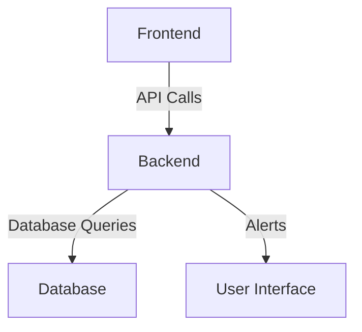

# Cybersecurity Threat Detection Tool

## Specification
This project implements a Cybersecurity Threat Detection Tool that analyzes network traffic and user behavior to identify anomalies and generate alerts.

## Architecture Diagram


## Setup Instructions
1. Clone the repository:
   ```bash
   git clone https://github.com/yourusername/cybersecurity-threat-detection-tool.git
   cd cybersecurity-threat-detection-tool
   ```
2. Build and run the services:
   ```bash
   docker-compose up --build
   ```
3. Access the frontend at `http://localhost:3000`.

## Running Tests
To run the tests, execute:
```bash
docker-compose exec backend pytest
```

## Key Features
### Fetch Threat Alerts
```bash
curl -X GET http://localhost:8000/api/alerts
```
### Create User Profile
```bash
curl -X POST http://localhost:8000/api/users -H 'Content-Type: application/json' -d '{"username": "testuser", "email": "test@example.com"}'
```